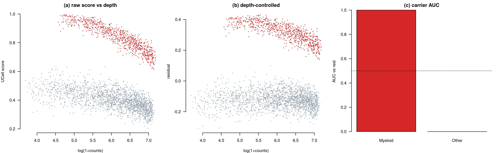
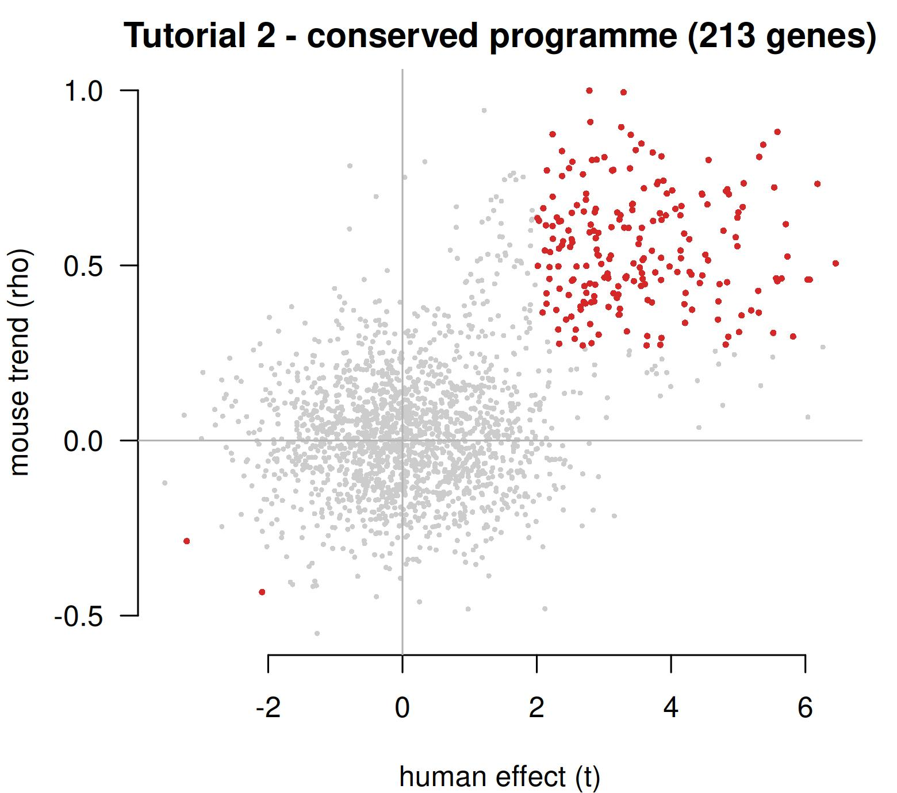
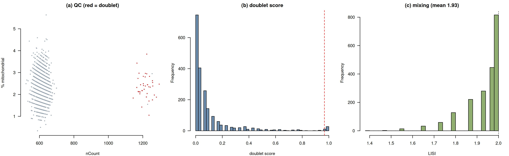
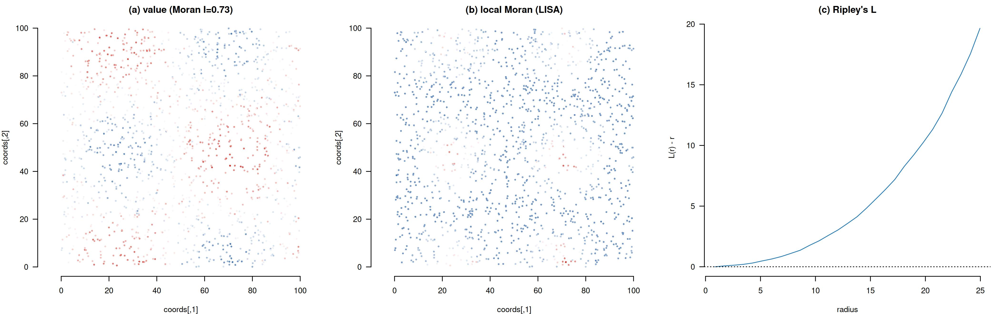
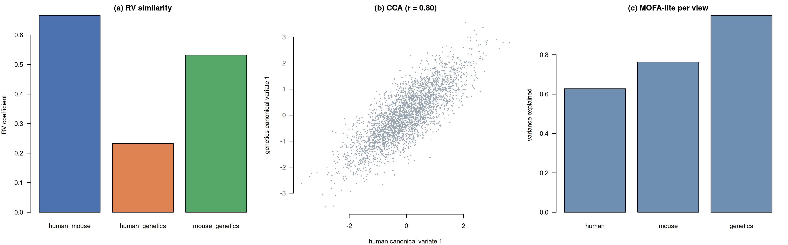

# omnikit

**Algorithm-first toolkit for kidney-disease multi-omics** — depth-robust gene-programme scoring,
cross-species conservation, spatial-niche statistics, and cross-omics integration.


`omnikit` is a small, **dependency-light** R package (base R + `Matrix`) in which every estimator is
implemented **from its definition** — nothing is a thin wrapper around an opaque package, so the
behaviour is auditable and reproducible offline. It is the **R canonical** implementation of the
`omnikit` toolkit; a Python mirror with the same mathematics lives at
[**pyomnikit**](https://github.com/LingzhangMeng/pyomnikit).

---

## Why this exists — purpose

Multi-omics analyses of small, heterogeneous disease cohorts (e.g. lupus-nephritis kidney biopsies)
keep failing in the **same four ways**. `omnikit` packages the correct, tested solutions to each so
they are applied consistently instead of being re-implemented (and re-broken) in every project.

### The problems it solves

| # | Problem (the failure mode) | What goes wrong | What `omnikit` does |
|---|---|---|---|
| **G4** | **Programme scores are confounded by sequencing depth.** On sparse 10x counts a rank-based signature score tracks *how many signature genes are detected*, so a cell's score rises with its depth (observed **ρ = +0.72** in real data). | "Marker" scores that are really depth proxies. | `omni_score_diagnostics` for every score, plus `omni_depth_control` (linear) and `omni_depth_stratified_auc` (non-parametric) corrections. |
| **G4** | **Cross-species conservation has no standard implementation.** Case-fold symbol matching silently drops alias / many-to-many orthologs; the significance test is ad-hoc. | Under- or over-calling conserved genes; irreproducible. | `omni_conservation` (Fisher combine + sign consistency + thresholds) with `omni_collapse_orthologs`. |
| **G3** | **QC is skipped or tool-dependent.** Doublet detection needs integer counts and a *calibrated* threshold; batch mixing is rarely quantified. | Residual doublets corrupt downstream clusters; hidden batch structure. | `omni_qc_metrics`, `omni_doublet_scrublet` (calibrated), `omni_mixing` (LISI). |
| **G2** | **Spatial coordinates are ignored** because processed objects often ship none, and niche statistics are non-trivial. | "No spatial structure" conclusions that are really "we didn't use x/y". | `omni_knn_graph`, `omni_moran`, `omni_geary`, `omni_lisa`, `omni_nhood_enrichment`, `omni_ripley`, `omni_spatial_lr`. |
| **G1** | **Cross-omics layers are analysed in isolation.** Genetics (eQTL/GWAS) and transcriptome are rarely integrated at matched resolution. | Missed (or overclaimed) cross-layer concordance. | `omni_joint_nmf`, `omni_cca`, `omni_rv`, `omni_procrustes`, `omni_mofa_lite`, `omni_program_gwas`. |
| — | **Fragile bespoke statistics.** AUC CIs, meta-analysis and FDR are re-written per script. | Inconsistent, unverified p-values. | `omni_delong`, `omni_stouffer`, `omni_eb_shrink`, `omni_fisher`, `omni_bh`, `omni_by`, `omni_perm_p`, `omni_auc`, `omni_mwu`. |

### How it solves them (design principles)

1. **No hidden depth confound** — every score can be interrogated with `omni_score_diagnostics`;
   the linear (`omni_depth_control`) and non-parametric (`omni_depth_stratified_auc`) corrections are
   first-class.
2. **Name the null** — each p-value is permutation, matched-control, or analytic, and says which.
3. **Deterministic** — every randomised estimator takes `seed=`.
4. **Auditable** — estimators are implemented from their definitions (below and in `docs/MATH.md`).

---

## Core algorithms

Every function is defined here and implemented from scratch. Let `x` be a per-cell score, `L` the
log library size, `S` a signature of `k` genes over `G` measured genes.

### G4 · UCell — rank-based programme score
Rank each cell's genes by descending expression (ties broken at random) and cap ranks at `maxRank`
(default 1500): `r_g = min(rank_g, maxRank)`. With `N = min(maxRank, G)`:

```
U = Σ_{g∈S} r_g ,        minU = k(k+1)/2 ,        maxU = k·N          (★)
UCell = (maxU − U) / (maxU − minU)  ∈ [0, 1]
```

**(★) the bound is `k·N`, not the distinct-rank sum** `k(2N−k+1)/2` — using the latter yields
negative/out-of-range scores once ranks are capped. Signed programmes use `UCell(up) − UCell(down)`.

### G4 · Depth control
Fit `x = a + b·log(1+counts)` (per group) and take the residual (`omni_depth_control` returns the
residual as a column and the diagnostics as attributes `r_before`, `r_after`). When the `x–depth`
relation is **non-linear** (exactly what the `maxRank` cap causes), `omni_depth_stratified_auc` is
the robust alternative: partition cells into log-count quantile bins and average the within-bin AUC.

### G4 · Cross-species conservation call
Per gene, combine the human and mouse p-values by Fisher (`X² = −2(ln p_H + ln p_M) ~ χ²₄`), then
BH-FDR. A gene is **conserved** iff the sign of the human effect agrees with the mouse trend
**and** `|t| ≥ t₀`, `|ρ| ≥ ρ₀`, `q < α` (defaults `2`, `0.27`, `0.05`). `omni_collapse_orthologs`
collapses many-to-many orthologs to one representative mouse gene per human gene.

### G4 · Carrier inference
Per cell type: **AUC vs rest** (Mann–Whitney) + BH-FDR. The **donor-aware** option computes a
pseudo-bulk mean per (donor × cell type) and a within-donor Wilcoxon contrast across donors — which
removes pseudo-replication without collapsing a donor's *opposing* compartments.

### core · DeLong AUC confidence interval
Placement values `V₁₀(i)=mean_j ψ(x_i,x_j)`, `V₀₁(j)=mean_i ψ(x_i,x_j)`, `ψ(a,b)=1[a>b]+½·1[a=b]`,
`Var(AUC)=Var(V₁₀)/n₁ + Var(V₀₁)/n₀` — computed with an O(n log n) midrank formulation.

### G3 · Scrublet doublet score
Simulate doublets as the sum of random cell pairs, embed observed+simulated by PCA, and score each
observed cell by the fraction of its k nearest neighbours that are simulated. Call doublets at the
**expected-rate quantile** (`0.8%` per 1000 cells), reporting the 2-GMM valley for reference.

### G3 · LISI batch mixing
`LISI_i = 1 / Σ_b p_{ib}²` over the batch distribution `p` of cell `i`'s k neighbours
(`1` = pure, `B` = fully mixed).

### G2 · Spatial statistics
Row-normalised kNN graph `W`. **Moran's I** `I = (n/S₀)·(zᵀWz)/(zᵀz)`; **Geary's C**
`C = ((n−1)/2S₀)·ΣW_ij(x_i−x_j)²/Σ(x_i−x̄)²`; **LISA** `I_i = z_i·Σ_j W_ij z_j`;
**neighbourhood enrichment** (cell-type co-occurrence z-scores); **Ripley's L(r)** with a border
correction; **spatial ligand–receptor** co-expression `Γ = Σ W_ij s_i s_j / Σ W_ij` — all with
permutation nulls.

### G1 · Integration
**Multi-view NMF** `X⁽ᵛ⁾ ≈ W H⁽ᵛ⁾` (shared sample factors, multiplicative updates);
**CCA** `σ_k` = singular values of `S_xx^{−½} S_xy S_yy^{−½}`; **RV coefficient**
`tr(S_xy S_yx)/√(tr S_xx² · tr S_yy²)`; **Procrustes** via SVD; **MOFA-lite** (multi-view EM factor
analysis, ridge-stabilised); **programme–GWAS** (scDRS-flavoured).

---

## Installation

```r
# from GitHub (recommended)
install.packages("remotes")
remotes::install_github("LingzhangMeng/omnikit")
```

```bash
# or from a clone
git clone https://github.com/LingzhangMeng/omnikit.git
R CMD INSTALL omnikit
```

Requirements: **R ≥ 4.1**; imports `stats` and `Matrix` (base/recommended only). The package is
**`R CMD check`-clean** (0 errors / 0 warnings / 0 notes).

```r
library(omnikit)
?omnikit                 # package overview; per-function help e.g. ?omni_ucell
```

---

## Tutorials

Five **self-contained** tutorials (synthetic data, no external files). Run them from the package
root; each prints results and writes a figure (`docs/figures/`) and tables (`docs/tutorial_outputs/`):

```bash
Rscript examples/tutorial_1_program_scoring.R
Rscript examples/tutorial_2_conservation.R
Rscript examples/tutorial_3_qc_doublets.R
Rscript examples/tutorial_4_spatial.R
Rscript examples/tutorial_5_integration.R
```

### Tutorial 1 — programme scoring, depth control, carriers (`tutorial_1_program_scoring.R`)

```r
score <- omni_ucell(X, list(prog = program_genes))[, "prog"]     # rank-based score
omni_score_diagnostics(score, rowSums(X))                        # Spearman(score, log counts)
dc <- omni_depth_control(score, log1p(rowSums(X)))               # residual (attr "r_after")
omni_carrier(dc$resid, celltype)                                 # AUC vs rest per cell type
```



Output: the raw score tracks depth (**ρ = −0.36** here; **+0.72** in real 10x data),
`omni_depth_control` reduces it (**−0.09**), and the myeloid population is the carrier
(**AUC = 1.00**) — see `docs/tutorial_outputs/tutorial_1_{carriers,diagnostics}.csv`.

### Tutorial 2 — cross-species conservation (`tutorial_2_conservation.R`)

```r
call <- omni_conservation(df, t_col = "human_t", rho_col = "mouse_rho",
                          ph_col = "human_p", pm_col = "mouse_p")
```



Output: **213 conserved genes, precision vs. the simulated truth = 0.99**
(`docs/tutorial_outputs/tutorial_2_conservation.csv`).

### Tutorial 3 — QC-first audit (`tutorial_3_qc_doublets.R`)

```r
qc <- omni_qc_metrics(X)                      # nCount / nFeature / %mt / %ribo / %hb
d  <- omni_doublet_scrublet(X)                # calibrated doublet call
mx <- omni_mixing(pcs, batch)                 # LISI
```



Output: **1.9 %** doublets called, **LISI = 1.93 of 2** batches
(`docs/tutorial_outputs/tutorial_3_*.csv`).

### Tutorial 4 — spatial niche statistics (`tutorial_4_spatial.R`)

```r
W  <- omni_knn_graph(coords, k = 6)
mo <- omni_moran(value, W, n_perm = 999)      # global autocorrelation
li <- omni_lisa(value, W)                      # local Moran
rp <- omni_ripley(coords)                      # Ripley's L
```



Output: a smooth synthetic field gives **Moran's I = 0.727** (p = 0.001) and **Geary's C = 0.273**
(`docs/tutorial_outputs/tutorial_4_*.csv`).

### Tutorial 5 — cross-omics integration (`tutorial_5_integration.R`)

```r
rv <- omni_rv(v1, v2)                          # 0.67
cc <- omni_cca(v1, v3, k = 3)                  # canonical correlations
mf <- omni_mofa_lite(list(v1, v2, v3), k = 2)  # multi-view factors
```



Output: **RV 0.67 / 0.23 / 0.53**, **CCA r = 0.80**, MOFA **variance explained 0.63 / 0.76 / 1.00**
(`docs/tutorial_outputs/tutorial_5_*.csv`).

---

## Modules

| module | functions |
|---|---|
| `stats` | `omni_auc`, `omni_mwu`, `omni_delong`, `omni_stouffer`, `omni_eb_shrink`, `omni_fisher`, `omni_cohen_d`, `omni_welch`, `omni_spearman`, `omni_perm_p`, `omni_bh`, `omni_by` |
| `depth` | `omni_depth_control`, `omni_depth_stratified_auc`, `omni_casefold_map`, `omni_collapse_orthologs` |
| `program` | `omni_ucell`, `omni_ucell_signed`, `omni_score_genes`, `omni_conservation`, `omni_carrier`, `omni_score_diagnostics` |
| `qc` | `omni_qc_metrics`, `omni_mad_outlier`, `omni_gmm2`, `omni_doublet_scrublet`, `omni_mixing` |
| `spatial` | `omni_knn_graph`, `omni_moran`, `omni_geary`, `omni_lisa`, `omni_nhood_enrichment`, `omni_ripley`, `omni_spatial_lr` |
| `integrate` | `omni_joint_nmf`, `omni_cca`, `omni_rv`, `omni_procrustes`, `omni_mofa_lite`, `omni_program_gwas` |
| `utils` | `omni_save` (PDF + JPEG, no gridlines), `omni_theme`, `omni_as_matrix`, `omni_rnames`, `omni_cnames` |

## Validation

```bash
Rscript tests/test_smoke.R        # 27 checks
```

- Reproduces a published **760-gene** cross-species conserved programme with **Jaccard = 1.0**.
- On a raw 10x kidney lane, `omni_depth_control` removes the depth confound (**ρ = +0.72 → +0.09**)
  while preserving the myeloid carriers.
- Deterministic: every randomised estimator takes `seed=`.

## Python mirror

The Python package **pyomnikit** (`pip install pyomnikit`, `import omnikit`) mirrors this package
function-for-function (`omni_<name>` in R vs `omnikit.<name>` in Python):
<https://github.com/LingzhangMeng/pyomnikit>.

## Citation

See `inst/CITATION` (R `citation("omnikit")`) and cite the underlying methods (UCell — Andreatta &
Carmona 2021; Scrublet — Wolock 2019; DeLong 1988; Moran 1950; Geary 1954; Lee & Seung 2001;
MOFA — Argelaguet 2018; scDRS — Zhang 2022), listed in [`docs/MATH.md`](docs/MATH.md).

## License

MIT © 2026 Lingzhang Meng — see [`LICENSE.md`](LICENSE.md).
